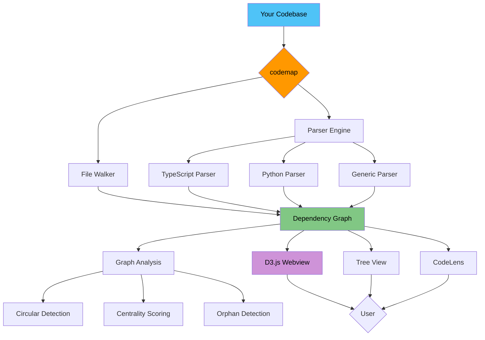

# 🗺️ codemap

### *"See your entire codebase as an interactive map — navigate, understand, refactor."*

[](https://marketplace.visualstudio.com/items?itemName=FMATheNomad.codemap)
[](LICENSE)
[](https://code.visualstudio.com/)
[](https://github.com/FMATheNomad/codemap/stargazers)
[](https://github.com/FMATheNomad/codemap/releases)
[](https://github.com/FMATheNomad/codemap/actions)
[](https://github.com/sponsors/FMATheNomad)
[](https://opencode.ai)
[](https://skills.sh/FMATheNomad/codemap)
[](https://github.com/FMATheNomad/codemap/pulls)

---

## ⭐️ Support This Project ⭐️

**This is a free, open-source VS Code extension built by a solo founder.**

[](https://github.com/FMATheNomad/codemap/stargazers)
[](https://github.com/sponsors/FMATheNomad)

**Every star & sponsor helps a solo founder keep building free tools for everyone.** 🙏

---

## 🚨 The Problem

You open a new codebase and have **zero idea** where to start.

- Where's the entry point?
- Which files are the most important?
- Are there circular dependencies waiting to blow up?
- What files does this change affect?

You waste **30 minutes** reading random files, opening folder after folder, manually tracing imports.

**There had to be a better way.**

---

## 🎯 What codemap Does

codemap transforms your codebase into an **interactive, real-time dependency graph** inside VS Code. One command, zero config.

```
codemap — Generating map for ~/projects/my-app
━━━━━━━━━━━━━━━━━━━━━━━━━━━━━━━━━━━━━━━━━━
✔ Scanning: 1,234 files found
✔ Parsing: TypeScript (892) | JavaScript (201) | Python (141)
✔ Building graph: 3,456 edges created
✔ Detecting circular dependencies: 2 found ⚠
━━━━━━━━━━━━━━━━━━━━━━━━━━━━━━━━━━━━━━━━━━
✅ Map ready: 1,234 files | 3,456 deps | 2 circular | 12 orphans
```

**Every file is a node. Every dependency is an edge. One click opens any file.**

---

## 📊 codemap vs Alternatives

| Feature | codemap | Dependency Cruiser | SourceGraph | Manual (folder hopping) |
|---------|:-------:|:------------------:|:-----------:|:----------------------:|
| Visual graph in editor | ✅ **D3.js force-directed** | ❌ CLI output only | ❌ Web app only | ❌ |
| Circular dependency detection | ✅ **Highlighted in red** | ✅ | ✅ | ❌ |
| Entry point detection | ✅ **Auto-detect main/index** | ❌ | ✅ | ❌ |
| Centrality scoring | ✅ **PageRank algorithm** | ❌ | ❌ | ❌ |
| Multi-language | ✅ **TS, JS, Python, +generic** | ✅ JS/TS only | ✅ Many | ✅ Any |
| Real-time interactivity | ✅ **Click → open, hover → detail** | ❌ | ❌ | ❌ |
| Search/filter nodes | ✅ **Live search box** | ❌ | ❌ | ❌ |
| Zero config | ✅ **One command** | ❌ Config file | ❌ Setup | ✅ |
| Orphan detection | ✅ **Find unused files** | ❌ | ✅ | ❌ |
| CodeLens integration | ✅ **Deps count inline** | ❌ | ❌ | ❌ |
| Offline | ✅ **100% local** | ✅ | ❌ Requires cloud | ✅ |
| Free & open source | ✅ **MIT** | ✅ MIT | ❌ Paid | ✅ |

**The bottom line:** codemap is the only VS Code extension that gives you a complete, interactive, multi-language dependency map with zero configuration — all running locally inside your editor.

---

## ⚡ Quick Start

```bash
# 1. Install from VS Code Marketplace
# Search "codemap" in Extensions panel, or:

# 2. Open any project folder
# 3. Press Ctrl+Shift+M (or Cmd+Shift+M on Mac)
```

**That's it.** Your codebase map appears in a new tab. Click any node to open the file. Hover for details. Search to filter.

---

## 🏗 Architecture



---

## 🗺️ Roadmap

- [x] Interactive D3.js force-directed graph
- [x] TypeScript/JavaScript/Python import parsing
- [x] Circular dependency detection with red highlight
- [x] Entry point detection with orange border
- [x] Centrality scoring (important files = bigger nodes)
- [x] Orphan file detection
- [x] Sidebar tree view with file hierarchy
- [x] CodeLens with dependency counts inline
- [x] Search/filter nodes in graph
- [x] Multi-language color-coded nodes
- [ ] Go parser (`golang` imports)
- [ ] Rust parser (`mod`, `use` statements)
- [ ] File watcher — auto-refresh on save
- [ ] Export map as PNG/SVG directly
- [ ] Theme support — match VS Code color theme exactly
- [ ] Focus mode — highlight a file and its deps, fade everything else
- [ ] Statistics panel — most coupled files, dependency depth distribution
- [ ] VS Code Marketplace publish with GitHub Actions

---

## 🔧 Features

### 🗺️ Interactive Code Map
- **Force-directed graph** powered by D3.js v7
- Node size = centrality (important files are bigger)
- Node color = language (TypeScript blue, JavaScript yellow, Python green)
- Entry points in **orange border**
- Circular dependencies in **red dashed lines**
- Orphan files at **50% opacity**

### 🔍 Smart Navigation
- **Click** any node → open file in editor
- **Hover** for tooltip with file path, dependency count, language
- **Search** box filters nodes in real-time
- **Drag** nodes to rearrange the layout
- **Zoom** and **pan** for exploration

### 📊 Dependency Analysis
| Metric | What It Tells You |
|--------|-------------------|
| **Centrality** | Which files are most imported (the "hubs") |
| **Circular deps** | Where your imports form cycles |
| **Orphans** | Files nobody imports (dead code?) |
| **Entry points** | Where the app starts (main/index files) |
| **Dependency count** | How coupled each file is |

### 📦 Multi-Language Support
| Language | Imports Parsed | Example |
|----------|---------------|---------|
| TypeScript | `import`, `export`, `require` | `import { x } from './foo'` |
| JavaScript | `import`, `require`, `exports` | `const x = require('./foo')` |
| Python | `import`, `from...import` | `from .utils import helper` |
| Generic | File references in strings | `"./config.json"` |

### ⌨️ Keyboard Shortcuts
| Shortcut | Action |
|----------|--------|
| `Ctrl+Shift+M` / `Cmd+Shift+M` | Generate map |
| `Ctrl+Shift+R` / `Cmd+Shift+R` | Refresh map |
| Right-click file → "Show Dependencies" | Open dependency list |
| Right-click folder → "Open in Map" | Open folder in map |

---

## 🧑‍💻 Development

```bash
git clone https://github.com/FMATheNomad/codemap
cd codemap
npm install
npm run compile
code .
# F5 to debug extension
```

### Project Structure

```
codemap/
├── src/
│   ├── extension.ts           # Entry point
│   ├── commands.ts            # 8 registered commands
│   ├── parser/                # Dependency graph engine
│   │   ├── graph.ts           # Graph data structure + algorithms
│   │   ├── typescript.ts      # TS/JS import parser
│   │   ├── python.ts          # Python import parser
│   │   └── generic.ts         # Generic file ref parser
│   ├── providers/             # Tree view, map data, CodeLens
│   ├── views/webview/         # D3.js visualization (offline)
│   ├── status/                # Status bar + progress
│   └── utils/                 # File walker, filter, config
└── test/                      # Test suite + fixtures
```

### Dogfooding

codemap can analyze itself:

```
codemap — Generating map for ~/codemap
━━━━━━━━━━━━━━━━━━━━━━━━━━━━━━━━━━━━━━━━━━
✔ Scanning: 42 source files found
✔ Parsing: TypeScript (42)
✔ Building graph: 156 edges created
✔ Detecting circular dependencies: 0 found 🎉
━━━━━━━━━━━━━━━━━━━━━━━━━━━━━━━━━━━━━━━━━━
✅ Map ready: 42 files | 156 deps | 0 circular | 3 orphans
```

---

## 🤝 Contributing

Contributions are welcome! See [CONTRIBUTING.md](CONTRIBUTING.md) for guidelines.

---

## 📜 License

MIT © [FMA Software Labs](https://github.com/FMATheNomad)

---

Built with ❤️ for developers who deserve to understand their codebase instantly.  
If codemap saves you time, please ⭐ star it — it makes a huge difference for a solo founder.

[](https://github.com/FMATheNomad/codemap/stargazers)
[](https://github.com/sponsors/FMATheNomad)
[](https://x.com/intent/tweet?text=See%20your%20entire%20codebase%20as%20an%20interactive%20map%20%E2%80%94%20navigate%2C%20understand%2C%20refactor.%20codemap%20for%20VS%20Code%20is%20free%20%26%20open%20source.%20%E2%9E%A1%EF%B8%8F&url=https://github.com/FMATheNomad/codemap)
[](https://www.reddit.com/r/vscode/submit?title=codemap%20-%20See%20your%20entire%20codebase%20as%20an%20interactive%20D3.js%20map%20inside%20VS%20Code&url=https://github.com/FMATheNomad/codemap)

[FMA Software Labs](https://fmasoftwarelabs.up.railway.app) · [@fmathenomad](https://x.com/fmathenomad) · [GitHub](https://github.com/FMATheNomad)
