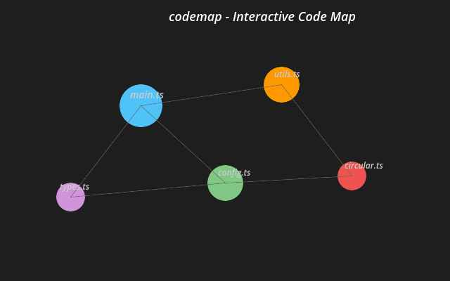

# 🗺️ codemap

[](https://marketplace.visualstudio.com/items?itemName=FMATheNomad.codemap)
[](LICENSE)
[](https://code.visualstudio.com/)
[](https://github.com/FMATheNomad/codemap/stargazers)
[](https://github.com/FMATheNomad/codemap/releases)
[](https://github.com/sponsors/FMATheNomad)
[](https://opencode.ai)
[](https://github.com/FMATheNomad/codemap/pulls)

### *"See your entire codebase as an interactive map — navigate, understand, refactor."*

codemap transforms your codebase into a real-time, interactive force-directed graph. Every file is a node, every dependency is an edge. Instantly spot circular dependencies, identify entry points, and understand the architecture of any project in seconds.



## Features

### 🗺️ Interactive Code Map
- **Force-directed graph** visualization powered by D3.js
- Files as nodes, dependencies as edges
- Node size = centrality (important files are bigger)
- Node color = language (TypeScript, Python, JavaScript, etc.)
- Entry points highlighted with orange border
- Circular dependencies marked in red with dashed lines

### 🔍 Smart Navigation
- Click any node → open file in editor
- Hover for tooltip with file stats
- Search/filter files by name
- Zoom, pan, and drag for exploration

### 📊 Dependency Analysis
- **Circular dependency detection** — find and fix cycles in your imports
- **Centrality scoring** — identify the most connected files
- **Orphan detection** — find unused files
- **Entry point detection** — automatically find main/index files
- **CodeLens** — see dependency counts inline in your editor

### 📦 Multi-Language Support
- **TypeScript / JavaScript** — ES imports, require(), exports
- **Python** — import, from-import, relative imports
- **Generic** — file references in strings and config files
- Extensible parser architecture for more languages

## Installation

### VS Code Marketplace
Install directly from [VS Code Marketplace](https://marketplace.visualstudio.com/items?itemName=FMATheNomad.codemap).

### From VSIX
1. Download the latest `.vsix` from [Releases](https://github.com/FMATheNomad/codemap/releases)
2. In VS Code, go to Extensions → `...` → Install from VSIX
3. Select the downloaded file

### From Source
```bash
git clone https://github.com/FMATheNomad/codemap.git
cd codemap
npm install
npm run compile
code .
# Press F5 to start debugging
```

## Usage

### Commands

| Command | Shortcut | Description |
|---------|----------|-------------|
| `codemap: Generate Map` | `Ctrl+Shift+M` / `Cmd+Shift+M` | Generate interactive dependency map |
| `codemap: Refresh Map` | `Ctrl+Shift+R` / `Cmd+Shift+R` | Re-scan and regenerate map |
| `codemap: Find Circular Dependencies` | — | List all circular dependencies |
| `codemap: Export Map` | — | Export map as JSON |
| `codemap: Toggle Map` | — | Show/hide map panel |
| `codemap: Open File in Map` | — | Highlight current file in map |
| `codemap: Show Dependencies` | — | Show dependencies of current file |

### Context Menu
- Right-click a file in the explorer → "Show Dependencies"
- Right-click a folder → "Open in Map"

### Settings

| Setting | Default | Description |
|---------|---------|-------------|
| `codemap.maxDepth` | `3` | Max directory depth for scanning |
| `codemap.excludePatterns` | `["**/node_modules/**", ...]` | Glob patterns to exclude |
| `codemap.autoGenerateOnOpen` | `true` | Auto-generate map when opening workspace |
| `codemap.theme` | `"dark"` | Map color theme (`dark` or `light`) |
| `codemap.maxNodes` | `10000` | Maximum files before warning |

## Visual Guide

### Node Legend

| Style | Meaning |
|-------|---------|
| 🔵 Blue circle | TypeScript file |
| 🟡 Yellow circle | JavaScript file |
| 🟢 Green circle | Python file |
| 🟠 Orange border | Entry point |
| 🔴 Red border | Circular dependency |
| Dimmed (50%) | Orphan file (no dependents) |

### Edge Legend

| Style | Meaning |
|-------|---------|
| ⚪ Gray line | Normal dependency |
| 🔴 Red dashed line | Circular dependency |

## Examples

### Small Project (10-50 files)
Quick overview of the entire architecture. Entry points are obvious, circular dependencies are flagged immediately.

### Medium Project (50-500 files)
The centrality scoring helps identify the most important modules. The search/filter helps navigate.

### Large Monorepo (500-10000 files)
codemap handles large workspaces with async generation, progress bars, and smart truncation. The max depth and exclude patterns keep the graph focused.

## Development

### Prerequisites
- Node.js 18+
- VS Code 1.96+

### Setup
```bash
npm install
npm run compile
code .
# F5 to debug
```

### Testing
```bash
npm test
```

### Build
```bash
npm run compile
```

## Architecture

```
src/
├── extension.ts           # Extension entry point
├── activate.ts            # Activation hooks
├── commands.ts            # All registered commands
├── providers/             # Tree, map, CodeLens providers
├── parser/                # Dependency graph parser engine
├── views/                 # Webview and tree views
├── status/                # Status bar and progress
└── utils/                 # File walker, filter, config
```

## Changelog

See [CHANGELOG.md](CHANGELOG.md) for the full changelog.

## Contributing

1. Fork the repo
2. Create a feature branch (`git checkout -b feature/amazing-feature`)
3. Commit your changes (`git commit -m 'feat: add amazing feature'`)
4. Push to the branch (`git push origin feature/amazing-feature`)
5. Open a Pull Request

## License

MIT © [FMATheNomad](https://github.com/FMATheNomad)

## Support

- ⭐ Star on [GitHub](https://github.com/FMATheNomad/codemap)
- 🐛 [Report a bug](https://github.com/FMATheNomad/codemap/issues)
- 💬 [Discussions](https://github.com/FMATheNomad/codemap/discussions)
- ☕ [Sponsor on GitHub](https://github.com/sponsors/FMATheNomad)

---

Built with ❤️ for developers who deserve to understand their codebase instantly.  
If codemap saves you time, please ⭐ star it.

[](https://github.com/sponsors/FMATheNomad)
[](https://github.com/FMATheNomad/codemap/stargazers)
[](https://x.com/intent/tweet?text=See%20your%20entire%20codebase%20as%20an%20interactive%20map%20%E2%80%94%20navigate%2C%20understand%2C%20refactor.%20codemap%20for%20VS%20Code%20is%20free%20%26%20open%20source.&url=https://github.com/FMATheNomad/codemap)

[FMA Software Labs](https://fmasoftwarelabs.up.railway.app) · [@fmathenomad](https://x.com/fmathenomad) · [GitHub](https://github.com/FMATheNomad)
